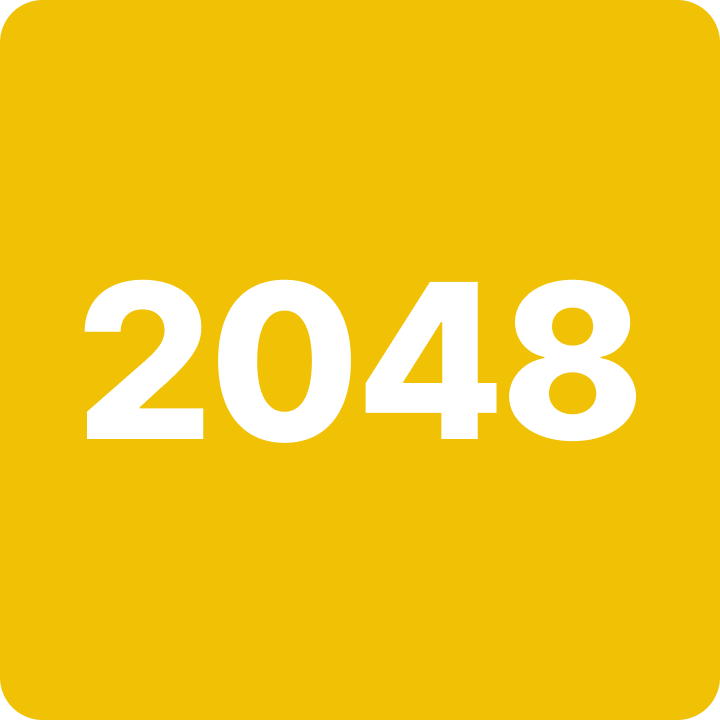

<table>
  <tbody>
    <tr>
      <td width="25%" valign="top"></td>
      <td width="75%" valign="top">
        <h1>2048</h1>
        
This is a port of the popular tile game by <a href="https://www.gabrielecirulli.com/">Gabriele Cirulli</a> written in <a href="https://elixir-lang.org/">Elixir</a>. This repo is a medium for me to experiment with the Elixir language, <a href="https://phoenixframework.org/">Phoenix</a> and <a href="http://erlang.org/doc/system_architecture_intro/sys_arch_intro.html">OTP</a>, to show off what I know, and so that my fiancé can play her favorite game without all of the annoying ads. 😝

        
The game uses LiveView, which obviously isn't ideal for this type of game, but, again, this is a sandbox for my personal learning and enjoyment. That said, if you have a decent internet connection, you likely won't notice any serious latency.

      </td>
    </tr>
  </tbody>
</table>

## Quick Start
To start the game:

  * Clone this repo with `git clone git@github.com:drewfravert/2048.com.git`
  * Install dependencies with `mix setup`
  * Generate a self-signed SSL certificate with `mix phx.gen.cert`
  * Add `game.local` as an alias to `localhost` in your `/etc/hosts` file
  * Start Phoenix endpoint with `mix phx.server`

Now visit [`https://game.local:4001`](https://game.local:4001) from your browser.

## Feature Roadmap
  * Leaderboard
  * Recap of played games
  * Live observation of ongoing games

## Requests / Questions
If you happen to find yourself playing this game and want to request a new feature or you have questions, you can reach me at [drew@fravert.dev](mailto:drew@fravert.dev).

## License
Licensed under the [MIT License](LICENSE.txt).
